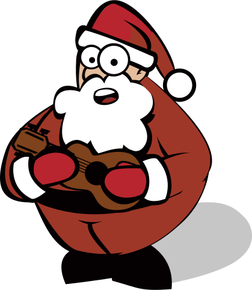

<!-- .slide: data-state="title" -->

# Online Graphics

---

## Bitmaps
<!-- .slide: data-state="textonimage" data-background-image="images/jess.jpg" -->

- AKA Raster Graphics
- Grid of pixels
- 3 dimensions: width, height, depth

---

## Bitmap Depth
<!-- .slide: data-state="textonimage" data-background-image="images/eyes_depth.png" -->

- Depth = how many colors
- More colors = richer depth
- Bigger depth = bigger size
- Great for Photographs

---

## Vectors

<!-- .element:  style="height: 50vh"-->

- Resolution independent
- Mathematical formulas
- Converted to Bitmaps

---

## Web Formats
- GIF
- JPG
- PNG
- SVG

---

## GIF
<!-- .element:  style="max-width: 50vw"-->
- Oldest format
- Up to 256 colors
- 1-bit transparency
- Supports animation

---

## JPEG
<!-- .element:  style="max-width: 40vw"-->

- 256 colors (8-bits) per channel
- Perfect for photos
- Highly compressed

---

## PNG
<!-- .element:  style="max-width: 40vw"-->

- Best quality (64-bits) per channel
- Best Transparency
- Not Lossy
- Not as small as JPEG
- Better at simple graphics

---

## SVG
<!-- .element:  style="max-width: 40vw"-->

- Great new format
- Vector Format
- Animation
- CSS Styling

---

## Reducing Image Size
- Cameras take HUGE pictures
- Crop or resize
- Reduce pixel density

---

## Reducing Size
- PNG - small colors QTY
- JPG for photos
- Resize/crop
- Thumbnails

---
<!-- .slide: data-state="title" -->

## Compression Exercise

<small>Use Photoshop to re-compress your sample images. Create Thumbnails of images at least 300px x 200px</small>
